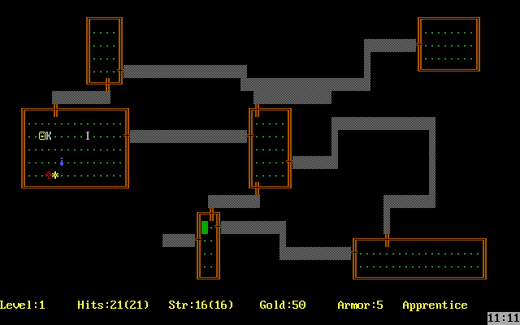

# VbRogue

A Rogue clone written in Visual Basic.

The purpose of this project is as a learning device to...

* learn fundamental programming techniques.
* write a game.
* use Visual Basic.
* work as a team (OSS).
* and do so using http://github.com.

This project is for those with little to no knowledge of programming as well as those whom have tons of experience and everyone in between.  The idea is to have fun while both learning and lending knowledge along the way.

Some of this collaboration is taking place through twitch.tv live-coding sessions that take place every Tuesday 8pm central.

NOTE: The purpose of this project is **not** to create a "rogue-like"; rather, we are using the original Rogue for inspiration and as a target design to build a project for the purposes of learning.  Once we have a "finished product"; where it goes from there is anyones guess... until then, we have a target that can be held steady. ;-)

## Some Specifics

* Use the latest version of VB.
* Building for .NET Core 3.x (current pre-release).
* "UI" will be a Console application.

## Folder Structure

* Documents - Contains reference materials for writing a rogue clone.
* Prototyping - Contains various prototypes that serve to experiment with ideas/techniques that can be leveraged to write the actual game.
* Rogue-likes - Contains several examples I've come across that demonstrate a "rogue-like" experience; including these examples for information purposes.

## Found a bug?

Please file any issues at https://github.com/DualBrain/VbRogue/issues.

## Coding Style

Although not 100% determined at this point, we will start by attempting to adhere to the guidelines as defined:

https://msdn.microsoft.com/en-us/library/ms229042(v=vs.110).aspx

and

http://addressof.com/blog/articles/codingguidelines.aspx

## Development

Prerequisites:
* Visual Studio 2019 (we are using the Community Edition)

To **develop** do the following:

* TBD
* Press <kbd>F5</kbd> to debug

To **test** do the following: `TBD`

## Contributing

We will start by attempting to follow the same contribution process that [corefx is using][corefx-contributing].

[corefx-contributing]: https://github.com/dotnet/corefx/wiki/Contributing

To discuss topics in "realtime", you can find many of us hanging out at https://gitter.im/VB-NET between broadcasts; and, of course, you can join us for the live-coding streams!

## License

The **official** source is available on https://github.com/DualBrain/VbRogue and licensed under the MIT license.

Acknowledgements
========

This project is inspired/influenced in part by:

 * Rogue (Epyx) circa early-to-mid-1980's
 
Technology references:

  * TBD
 
Logo by TBD.

Additional Resource
========

* [Rogue (c)1983 Artificial Intelligence Design MS-DOS Version (DosBox on Archive.org)](https://archive.org/details/ROGUE_PD)
* [Rogue (c)1983 (CRACKED - CODEBUSTERS, INC.) MS-DOS Version (DosBox on Archive.org)](https://archive.org/details/msdos_Rogue_1983)
* [Rogue (c)1985 Epyx Mac Version (Emulation on Archive.org)](https://archive.org/details/mac_Rogue)
* [Rogue (like) (c)1988 Mastertronic C64 (Emulation at Archive.org)](https://archive.org/details/d64_Rogue_1988_Mastertronic)
* [Rogue (like?) (c)1987 Antic Atari 800xl (Emulation at Archive.org)](https://archive.org/details/a8b_Atari_Rogue_1987_Antic_US_BASIC)
* [Rogue (Like?) (c)1988 MasterTronic ZX Spectrum (Emulation at Archive.org)](https://archive.org/details/zx_Rogue_1988_Mastertronic#)
* [Rogue (like?) (c)1987 Mastertronic Atari 800xl (Emulation at Archive.org)](https://archive.org/details/a8b_Rogue_1988_Mastertronic_GB_k_file)
* [Rogue Clone (c)1988 MS-DOS (DosBox at Archive.org](https://archive.org/details/msdos_Rogue_Clone_1988)
* [Rogue Box Cover for Atari ST](https://archive.org/details/firstera_rogue)
* http://www.old-games.com/download/4041/rogue-epyx-
* http://coredumpcentral.org
